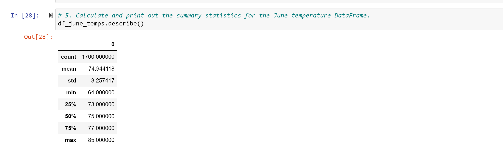
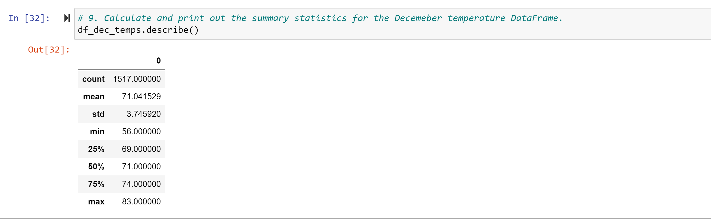
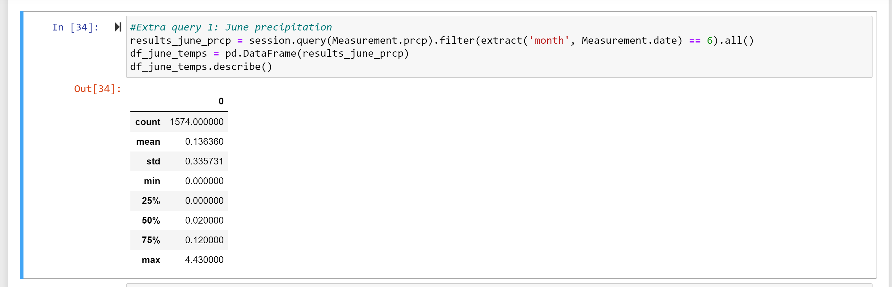
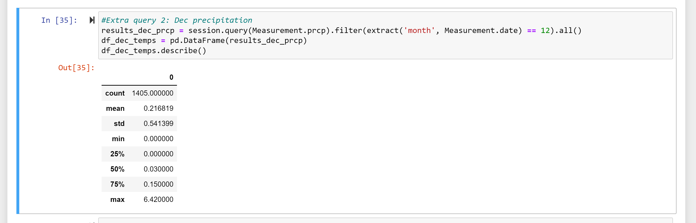

# surfs_up By David Matheny, 2/13/2022

# Overview of the analysis:
W. Avy wants more information about temperature trends before opening the surf shop. Specifically, he wants temperature data for the months of June and December in Oahu, in order to determine if the surf and ice cream shop business is sustainable year-round.  I do think that in addition to temperature W. Avy should look into how much it rains, this could be a huge factor.

# Results:Temps for June and December

## Deliverable 1: Below are summary statistics for the temperatures for the month of June

## Deliverable 2: Below are summary statistics for the temperatures for the month of December

# Summary: 
Based on the analysis for temperatures specifically June and December I would say that surf shop sounds like a good idea.  The temperatures did not seem to vary enough to be a concern.  I would like to see how precipitation is for both these months as well. Below is precipitation for June and December. It does look like the rain in December could be an issue.

## Below are summary statistics for the precipitation for the month of June

## Below are summary statistics for the precipitation for the month of December

